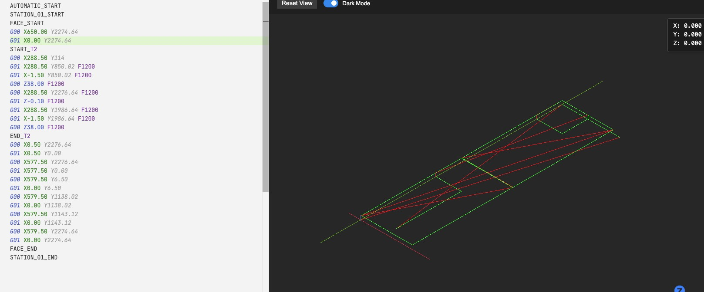

# NC Viewer

A Visual Studio Code extension for viewing NC/G-code files with interactive 3D visualization.

## Features

- ✨ **Integrated Preview** - Open a 3D preview of your G-code directly in the editor.
- 🚀 **Quick Access** - Launch the viewer with a dedicated icon in the editor title bar or with a keyboard shortcut.
- ⌨️ **Keyboard Shortcut** - Use `Ctrl+K V` to open the preview, just like with Markdown files.
- 🎯 **Offline & Secure** - Works without an internet connection and opens files directly from your workspace. No file uploads.
- 🎨 **3D Path Visualization** - Interactive Three.js rendering of toolpaths.
- 🌙 **Dark/Light Themes** - Automatically matches your VS Code theme.
- 📊 **Real-time Position Tracking** - See current X/Y/Z coordinates as you scrub through the timeline.
- 🧮 **Sinumerik Macro Awareness** - Evaluates R-parameters and variable expressions so macro-driven programs preview correctly. See the curated programs in `examples/sinumerik_macro/` for ready-to-run samples you can use to verify macro behavior inside the viewer.

## Macro programming samples

Looking for quick Sinumerik-style R-parameter programs to verify the macro interpreter? Load the numbered examples under `examples/sinumerik_macro/` to work from simple to complex routines:

1. `01_basic_square_pocket.nc` – A square-pocket routine that sets up toolpath dimensions entirely through `R` values.
2. `02_drilling_array.nc` – A drilling grid that increments `R` values between canned cycles to mimic micro programming loops.
3. `03_helical_entry.nc` – A helical entry move that derives radii from expressions involving multiple parameters.
4. `04_parametric_rectangle.nc` – A finishing routine that grows or shrinks a rectangular boss plus its lead-ins using only `R` assignments.
5. `05_variable_octagon.nc` – A regular-octagon profile whose chamfer widths and approach moves come from arithmetic on the macro values.

Each program is annotated so you can tweak parameters and immediately observe the effect inside the renderer.

## Usage

1. Open any `.nc`, `.gcode`, or `.cnc` file in VS Code.
2. Click the "Open Preview" icon in the editor title bar (top-right).
3. Alternatively, use the keyboard shortcut `Ctrl+K V`.
4. View your toolpath in 3D!

## Installation

Install from the VS Code Marketplace or build from source.

## Credits

This extension is inspired by [NCviewer](https://github.com/NCalu/NCviewer) by NCalu.
Thanks for the excellent web-based G-code viewer that made this VS Code integration possible!

## License

MIT